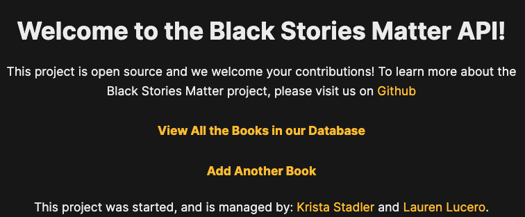

# Black Stories Matter 
The goal of Black Stories Matter API is to build a database of children's books by Black authors for educators, families and youth. 
If a book is not already listed, users can visit the API interface to add children's books by Black authors to the database.
Add a title by entering the 10 digit ISBN number assigned to each separate edition and variation of a publication to add it to the database.

[Deployed Application](https://black-stories-matter-api.herokuapp.com/)

## Technologies
Things you may want to cover:
* Ruby version
* System dependencies
* Configuration
* Database creation
* Database initialization
* How to run the test suite
* Services (job queues, cache servers, search engines, etc.)
* Deployment instructions
* ...

## Future Iterations
We would like to continue adding books to the database and add more functionality to the front end user interface.
Please see the CONTRIBUTING file if you are interested in making an open source contribution to this project!

## Contributors
- Back End [Repo](https://github.com/Black-Stories-Matter/black_stories_matter_api) 
  - [Krista Stadler](https://github.com/kristastadler)
- Front End [Repo](https://github.com/Black-Stories-Matter/black-stories-matter-fe) 
  - [Lauren Lucero](https://github.com/laurenlucero)
